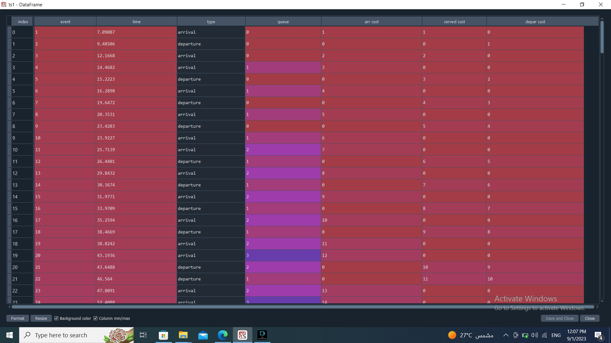
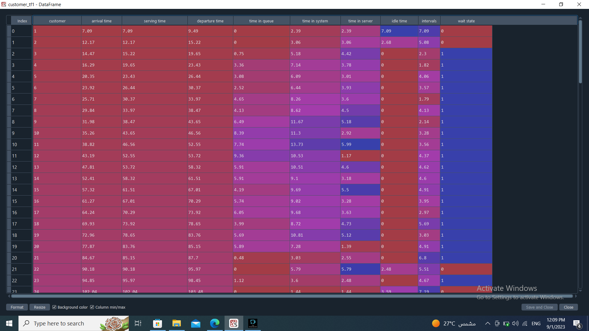
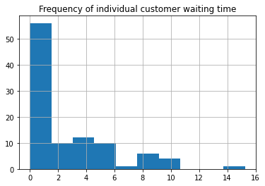
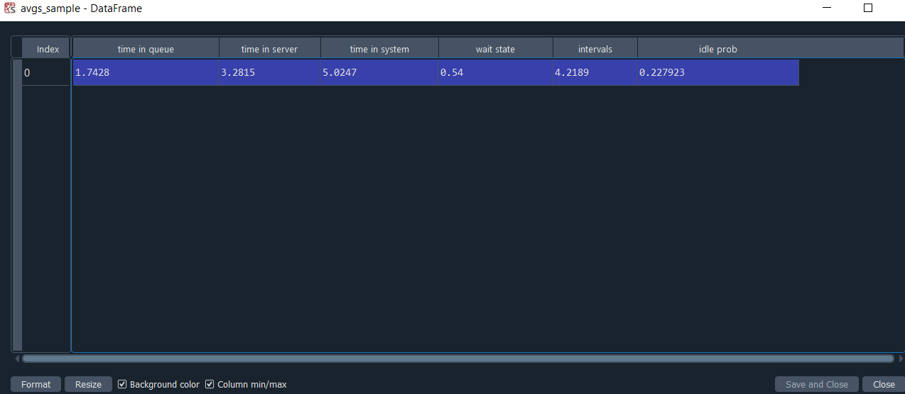
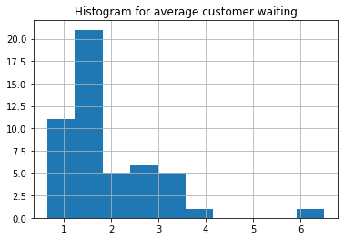
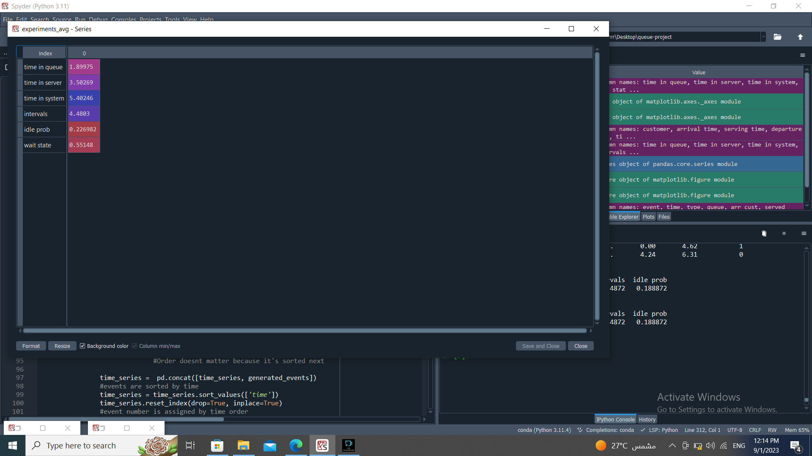

# Grocery Store Single-Server Queue Simulation

A discrete-event, simulation-table model of a grocery store checkout with **one server**, built with `numpy`, `pandas` and `matplotlib`.
The script generates the event list of a single run, derives a per-customer table, computes the performance measures of the run, and repeats the experiment 50 times to study the variability of the average waiting time.

| | |
|---|---|
| **Author** | Ammar Elsayed Elsherif |
| **Script** | `20235016_Ammar-Elsayed-Elsherif_simulation-table-project_code.py` |
| **Python** | 3.9+ (developed on 3.11) |
| **Libraries** | `numpy`, `pandas`, `matplotlib` |

---

## Table of Contents

1. [Model](#model)
2. [Quick Start](#quick-start)
3. [Code Structure](#code-structure)
4. [Results](#results)
5. [Reproducibility](#reproducibility)
6. [Code Conventions](#code-conventions)
7. [Known Limitations](#known-limitations)

---

## Model

| Parameter | Value |
|---|---|
| Inter-arrival time | Uniform(1, 8) |
| Service time | Uniform(1, 6) |
| Servers | 1 |
| Queue discipline | FIFO, unlimited capacity |
| Events per run | 200 (about 100 customers) |
| Initial state | Empty system, server idle, clock at 0 |

Expected load: mean inter-arrival 4.5 and mean service 3.5 give a utilisation of roughly 0.78, so the queue is stable but waiting is common.

**Event logic**

- **Arrival** – schedule the next arrival. If the server is idle, the customer starts service immediately and a departure is scheduled; otherwise the queue length increases by one.
- **Departure** – if the queue is empty the server becomes idle; otherwise the next customer starts service, the queue decreases by one and a new departure is scheduled.

---

## Quick Start

```bash
pip install numpy pandas matplotlib
python 20235016_Ammar-Elsayed-Elsherif_simulation-table-project_code.py
```

The script can also be run cell by cell in Spyder. Running it prints the averages of both experiments and writes `histogram-1.png` and `histogram-2.png` next to the script (set `SAVE_FIGURES = False` to disable).

---

## Code Structure

| Function | Purpose | Output |
|---|---|---|
| `generate_ts(seed)` | Simulates one run and builds the event time series | Event table |
| `get_customer_tf(time_series)` | Pivots events into one row per customer | Customer table |
| `get_Q_avgs(customer_df)` | Averages the customer table | One-row dataframe |
| `run_queue(seed)` | Runs the three steps above for one seed | One-row dataframe |
| `run_experiments(n_runs)` | Repeats `run_queue` for seeds `0 … n_runs-1` | `n_runs` × 6 dataframe |

---

## Results

### 1. Event time series (single run, seed 25)

Every row is an event (arrival or departure) ordered by time, with the queue length and the customer counters at that moment.



| Column | Meaning |
|---|---|
| `event` | Event number in time order |
| `time` | Simulation clock at the event |
| `type` | `arrival` or `departure` |
| `queue` | Queue length after the event |
| `arr cust` / `served cust` / `depar cust` | Customer number arriving, starting service, or departing |

### 2. Customer table (single run, seed 25)



| Column | Meaning |
|---|---|
| `time in queue` | Serving time − arrival time |
| `time in server` | Departure time − serving time |
| `time in system` | Departure time − arrival time |
| `idle time` | Server idle time before this customer (only when they did not wait) |
| `intervals` | Time since the previous arrival |
| `wait state` | `1` if the customer waited, `0` otherwise |

### 3. Waiting-time distribution (single run, seed 25)

More than half of the customers are served immediately; the rest form a long right tail.



### 4. Averages of a single run (seed 31)



### 5. Experiment: 50 independent runs (seeds 0–49)

Each run contributes one average waiting time. The histogram shows how much a single run can deviate from the typical value.



Overall averages across the 50 runs:



| Measure | Mean over 50 runs |
|---|---|
| Time in queue | 1.90 |
| Time in server | 3.50 |
| Time in system | 5.40 |
| Time between arrivals | 4.48 |
| Server idle probability | 0.227 |
| Probability of waiting | 0.551 |

The measured service time (3.50) and inter-arrival time (4.48) agree with the theoretical means (3.5 and 4.5).

---

## Reproducibility

Results are deterministic: each run calls `np.random.seed(seed)` and draws its random numbers in a fixed order.

| Output | Seed |
|---|---|
| Time series, customer table, histogram 1 | `25` |
| Single-run averages | `31` |
| 50-run experiment | `0 … 49` |

> **Do not reorder the `np.random.uniform` calls** inside `generate_ts` (next arrival first, then service time). Changing the order changes every number above.

If your numbers differ from the screenshots, check in this order: the seeds above, the order of random draws, and the `pandas` version.
The original version of this project used `DataFrame.append` and chained assignment, which fail on `pandas` 2.x and silently produce wrong data on `pandas` 3.x. The current script avoids both and was verified to reproduce the screenshots on `pandas` 3.0.

---

## Code Conventions

- A module docstring lists the author, assignment, pipeline and libraries.
- Sections are separated by banner strings: `'''---- section title ----'''`.
- Short lowercase `#` comments sit **above** the line they describe, with no trailing period.
- Constants (parameters, column lists) are uppercase and defined once at the top.
- Plotting and printing live under `if __name__ == '__main__':`, so the functions can be imported without side effects.

---

## Known Limitations

- The model uses uniform distributions, so strictly it is a **G/G/1** queue and not an M/M/1 queue (which requires exponential times).
- `server_status` is a look-ahead flag: it records whether the server will still be busy at the **next arrival** (next arrival time < last scheduled departure). It works, but it is not a state updated at each event.
- The customer table rounds times to 2 decimals *before* computing `idle time` and `intervals`, so these two columns carry small rounding effects.
- Each run stops after 200 events, so the last customers still in the system are cut off and the end of the run is not at steady state. Results also include the empty-start transient.
- 50 runs give a rough estimate; confidence intervals would need more runs.
